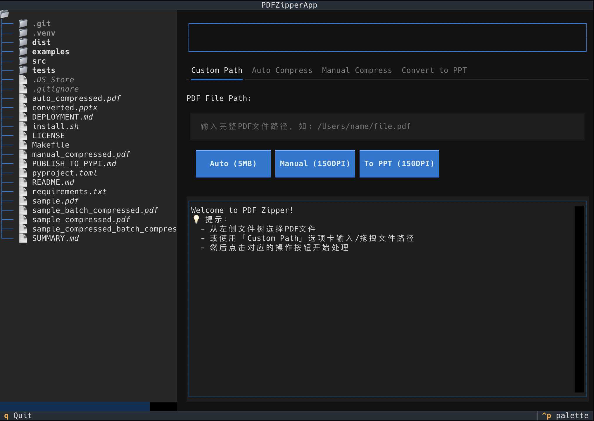
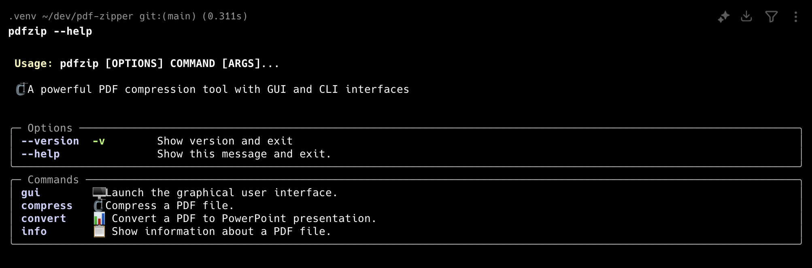

# 🗜️ PDF Zipper

<div align="center">

[](https://badge.fury.io/py/pdf-zipper)


</div>

A powerful file processing tool supporting PDF compression, format conversion (PDF ↔ PPTX), with both GUI and CLI interfaces, built with modern Python.

## 📸 Screenshots

<div align="center">
<table>
<tr>
<td width="50%">

### 🖥️ Beautiful Terminal GUI

*Interactive file browser with drag & drop support*

</td>
<td width="50%">

### ⌨️ Powerful Command Line Interface

*Rich output with progress indicators and detailed info*

</td>
</tr>
</table>
</div>

## ✨ Features

- **🎯 Auto Compression**: Automatically compress PDFs and PPTX files to a target file size
- **🔧 Manual Compression**: Compress PDFs with custom DPI settings
- **📊 Bi-directional Conversion**: Convert between PDF and PowerPoint formats (PDF ↔ PPTX)
- **📁 Multi-format Support**: Process both PDF (.pdf) and PowerPoint (.pptx) files
- **🖥️ Beautiful GUI**: Modern terminal-based interface using Textual
- **⌨️ CLI Interface**: Full command-line support with rich output
- **📁 Drag & Drop Support**: Easy file selection in GUI mode
- **🔄 Format Detection**: Automatic file type detection and validation
- **📦 Easy Installation**: Install as a system command

## 🚀 Installation

### From PyPI (Recommended)
```bash
pip install pdf-zipper
```

### From Source
```bash
git clone https://github.com/your-username/pdf-zipper.git
cd pdf-zipper
pip install -e .
```

### Standalone Executable (No Python Required)

<pre align="center">
🧪 Working in Progress
</pre>

Download the pre-built executable for your platform:

**macOS (Apple Silicon)**
```bash
# Option 1: App Bundle (Recommended for GUI users)
# Download PDF-Zipper-darwin-arm64.app from releases page
# Double-click to launch GUI interface

# Option 2: Command Line Executable
# Download from releases page
chmod +x pdf-zipper-gui-darwin-arm64
./pdf-zipper-gui-darwin-arm64 --help
./pdf-zipper-gui-darwin-arm64 gui  # Launch GUI
```

**Windows**
```cmd
REM Download from releases page
pdf-zipper-cli-windows-x64.exe --help
```

**Linux**
```bash
# Download from releases page
chmod +x pdf-zipper-cli-linux-x64
./pdf-zipper-cli-linux-x64 --help
```

### From Source
```bash
git clone https://github.com/your-username/pdf-zipper.git
cd pdf-zipper
pip install -e .
```

### Using Installation Script
```bash
git clone https://github.com/your-username/pdf-zipper.git
cd pdf-zipper
./install.sh
```

## 📖 Usage

### CLI Commands

After installation, you can use `pdf-zipper` or `pdfzip` commands:

```bash
# Launch GUI
pdf-zipper gui

# Compress PDF to specific size (auto mode)
pdf-zipper compress input.pdf --target-size 5.0

# Compress PDF with specific DPI (manual mode)
pdf-zipper compress input.pdf --dpi 150

# Convert PPTX to PDF (new feature!)
pdf-zipper compress presentation.pptx

# Convert PDF to PowerPoint
pdf-zipper convert input.pdf

# Convert PowerPoint to PDF (new feature!)
pdf-zipper convert presentation.pptx

# Show file information (supports PDF and PPTX)
pdf-zipper info input.pdf
pdf-zipper info presentation.pptx

# Show help
pdf-zipper --help
```

The CLI provides rich, colorful output with progress indicators and detailed information (see CLI screenshot above).

### GUI Mode
```bash
pdf-zipper gui
```

The GUI provides an intuitive interface with file browser, drag & drop support, and real-time progress logging (see screenshot above).

### Programmatic Usage
```python
from pdf_zipper import autocompress, autocompress_pdf, autocompress_pptx, autocompress_pdf_to_pptx, compress_pdf, convert_to_ppt

# Universal auto compression (supports format conversion)
autocompress("input.pdf", "output.pdf", 5.0, print)      # PDF → PDF
autocompress("input.pptx", "output.pptx", 5.0, print)    # PPTX → PPTX
autocompress("input.pdf", "output.pptx", 5.0, print)     # PDF → PPTX (NEW!)

# Specific auto compression functions
autocompress_pdf("input.pdf", "output.pdf", 5.0, print)           # PDF → PDF
autocompress_pptx("input.pptx", "output.pptx", 5.0, print)        # PPTX → PPTX
autocompress_pdf_to_pptx("input.pdf", "output.pptx", 5.0, print)  # PDF → PPTX (NEW!)

# Manual compression and conversion
compress_pdf("input.pdf", "output.pdf", 150, print)      # Manual PDF compression
convert_to_ppt("input.pdf", "output.pptx", 150, print)   # PDF → PPTX conversion
```

## 🛠️ Development

### Setup Development Environment
```bash
git clone https://github.com/your-username/pdf-zipper.git
cd pdf-zipper
pip install -e ".[dev]"
```

### Run Tests
```bash
pytest
```

### Code Formatting
```bash
black src/
isort src/
```

## 📋 Requirements

- Python 3.8+
- PyMuPDF (fitz)
- Pillow
- python-pptx
- rich
- textual
- typer

## 🔧 How It Works

1. **Auto Compression**:
   - **PDF → PDF**: Uses binary search to find the optimal DPI that achieves the target file size
   - **PPTX → PPTX**: Converts PPTX → PDF → optimizes DPI → converts back to PPTX
   - **PDF → PPTX**: Optimizes PDF DPI → converts to PowerPoint format (NEW!)
2. **Manual Compression**: Converts PDF pages to images at specified DPI and recreates the PDF
3. **Format Conversion**:
   - **PDF to PPT**: Extracts each page as an image and creates PowerPoint slides
   - **PPTX to PDF**: Uses system tools (LibreOffice, unoconv) or Windows COM interface

## 💡 Tips

- Higher DPI = better quality but larger file size
- Auto compression may take longer but provides precise size control
- For best results, start with the auto compression feature
- **Format Conversion Options**:
  - **PDF → PDF**: Direct optimization for fastest processing
  - **PPTX → PPTX**: Maintains PowerPoint format while achieving target size
  - **PDF → PPTX**: Convert and optimize in one step (NEW!)
- Use the GUI for interactive file selection and real-time progress
- Use CLI for batch processing and automation

## 📄 License

MIT License - see [LICENSE](LICENSE) file for details.

## 🤝 Contributing

Contributions are welcome! Please feel free to submit a Pull Request.
